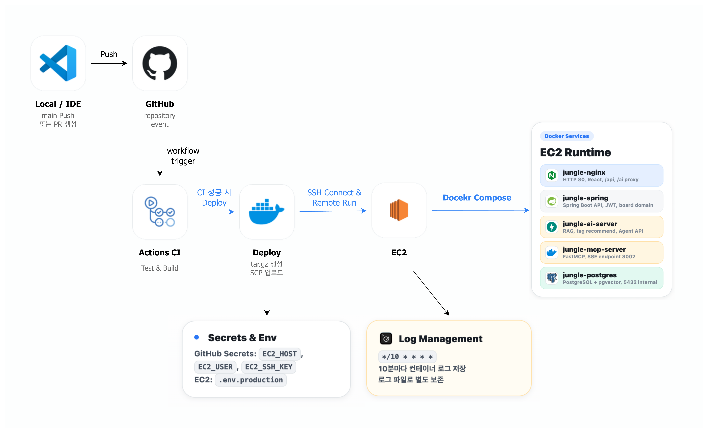
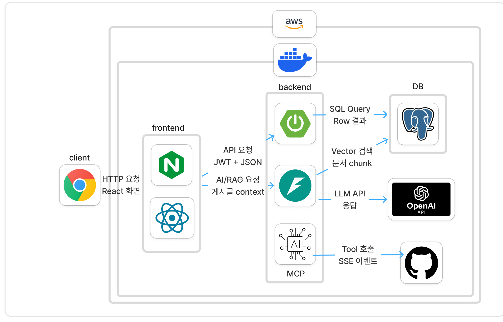
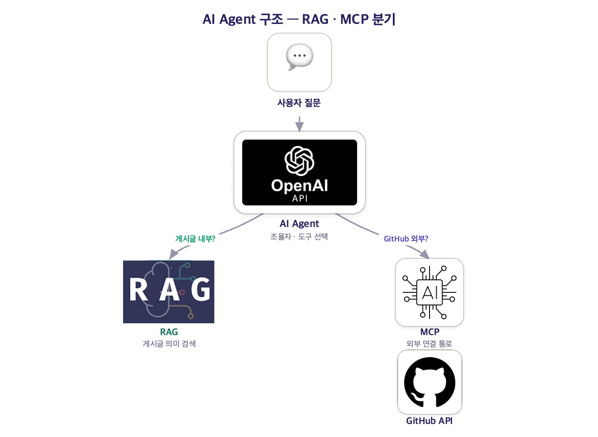
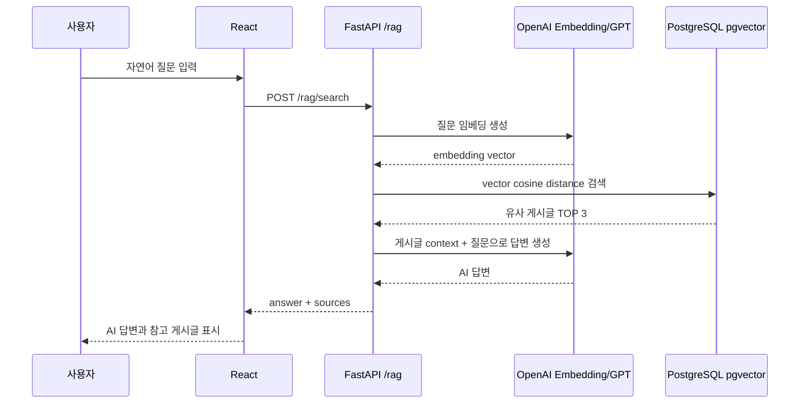
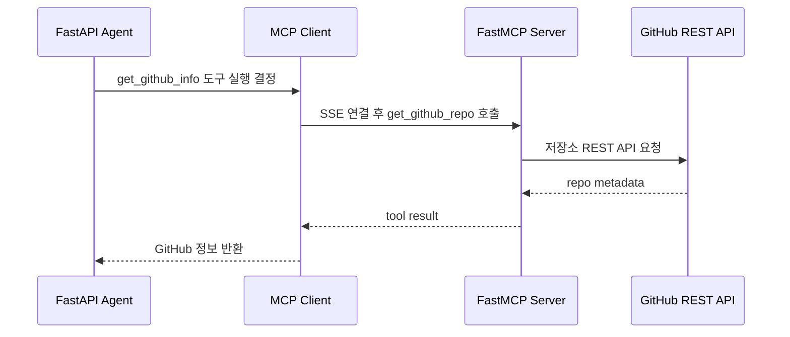
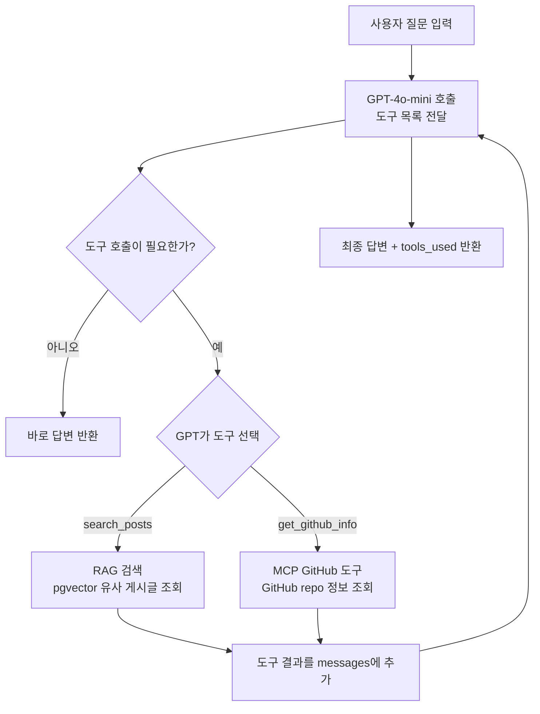
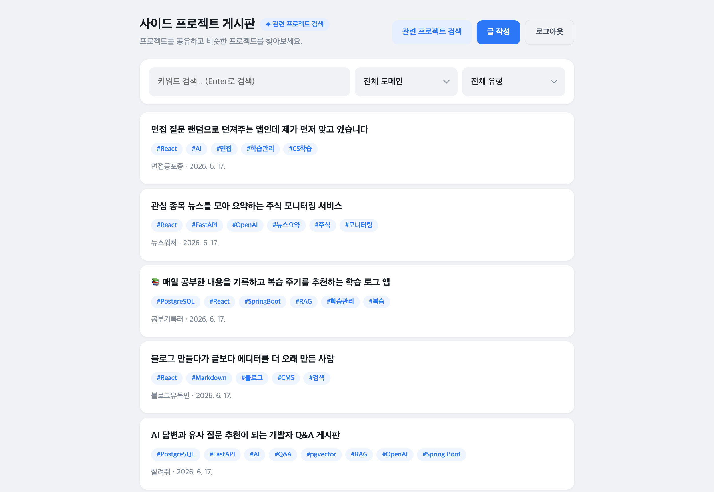

# 사이드 프로젝트 공유 게시판

개발자들이 자신의 사이드 프로젝트를 공유하고, 댓글로 피드백을 주고받으며, AI를 활용해 프로젝트를 더 쉽게 탐색하고 개선 아이디어를 얻을 수 있는 커뮤니티 게시판입니다.

## 1. 프로젝트 개요

이 프로젝트는 일반 게시판 기능에 RAG, MCP, Agent 기반 AI 기능을 결합한 사이드 프로젝트 공유 서비스입니다.

- 사용자는 회원가입/로그인 후 프로젝트 게시글을 작성하고 수정/삭제할 수 있습니다.
- 게시글에는 제목, 본문, GitHub URL, 도메인 카테고리, 프로젝트 유형, 태그를 함께 저장합니다.
- 게시글 저장/수정/삭제 시 AI 서버와 연동해 RAG 검색용 임베딩을 자동으로 갱신합니다.
- AI 검색은 사용자의 자연어 질문을 게시글 벡터 검색과 GPT 답변으로 연결합니다.
- MCP/GitHub 연동은 게시글에 연결된 GitHub 저장소 정보를 불러와 상세 화면과 AI 개선 제안에 활용합니다.
- AI Agent는 RAG 검색과 GitHub MCP 도구를 조합해 사용자의 질문에 답변합니다.

## 2. 주요 구현 기능

### 사용자/인증

- 이메일, 비밀번호, 닉네임 기반 회원가입
- JWT 기반 로그인 인증
- React `ProtectedRoute`로 로그인 필요 화면 보호
- Axios interceptor를 통한 `Authorization: Bearer <token>` 자동 주입
- 401 응답 시 토큰 제거 후 로그인 화면으로 이동

### 게시글

- 게시글 목록 조회, 검색, 도메인 필터, 프로젝트 유형 필터, 페이징
- 게시글 상세 조회
- 게시글 작성, 수정, 삭제
- 작성자 본인일 때만 수정/삭제 버튼 노출
- 태그 입력, 중복 태그 방지, 태그 삭제
- 도메인 카테고리와 프로젝트 유형 카테고리 선택
- GitHub URL 저장 및 상세 화면 링크 표시

### 댓글

- 게시글별 댓글 목록 조회
- 댓글 작성, 수정, 삭제
- 댓글 작성자 본인일 때만 수정/삭제 버튼 노출
- 댓글 삭제 시 커스텀 확인 모달 사용

### AI 기능

- RAG 자연어 검색: 질문 임베딩 → pgvector 유사 게시글 검색 → GPT 답변 생성
- RAG 관련 게시글 추천: 현재 게시글 본문 기반으로 유사 게시글 추천
- RAG 태그 추천: 작성 중인 제목/본문과 유사 게시글의 태그 빈도를 기반으로 추천
- GitHub API 기반 태그 보강: GitHub topics와 주 사용 언어를 태그 후보로 제안
- MCP GitHub 정보 조회: stars, forks, language, open issues, topics, last commit 조회
- AI Agent 질의응답: GPT가 RAG 검색 도구와 GitHub 정보 조회 도구를 선택해 답변
- Agent 개선 제안: GitHub 저장소 현황과 유사 게시글을 바탕으로 프로젝트 개선 아이디어 생성

### UI/디자인

- Toss 스타일 디자인 시스템 기반 CSS 변수 적용
- 공통 UI 컴포넌트 분리
  - `Button`
  - `Card`
  - `TextInput`
  - `Textarea`
  - `Select`
  - `TagChip`
  - `CategoryBadge`
  - `AIBadge`
  - `ToolBadge`
  - `PostCard`
  - `Pagination`
  - `LoadingIndicator`
  - `ErrorMessage`
  - `EmptyState`
  - `ConfirmDialog`
  - `Toast`
- AI 관련 영역은 `AIBadge`, `ToolBadge`, AI 버튼 스타일로 일반 CRUD 영역과 시각적으로 구분

### 배포/운영

- Docker Compose 기반 통합 실행
- Nginx Gateway를 통해 프론트엔드 정적 파일, Spring API, FastAPI AI API 라우팅
- PostgreSQL + pgvector 컨테이너 사용
- GitHub Actions CI/CD 워크플로우 구성
- EC2 배포용 Dockerfile 및 Nginx 설정 포함



## 3. 전체 아키텍처 구조



### 주요 서버 역할

| 구성 요소 | 포트 | 역할 |
| --- | --- | --- |
| `nginx` | `80` | React 정적 파일 제공, `/api`, `/ai` 프록시 |
| `spring` | `8080` | 회원/게시글/댓글/카테고리 API, JWT 인증, AI 서버 연동 |
| `ai-server` | `8000` | RAG 검색, 태그 추천, Agent API, GitHub API 프록시 |
| `mcp-server` | `8002` | FastMCP 기반 GitHub 도구 서버 |
| `postgres` | `5432` | 서비스 데이터와 pgvector 임베딩 저장 |

### 데이터 흐름 요약

1. 브라우저는 Nginx Gateway로 요청합니다.
2. `/api/**` 요청은 Spring Boot로 전달됩니다.
3. `/ai/**` 요청은 FastAPI AI 서버로 전달됩니다.
4. Spring Boot는 게시글 데이터를 PostgreSQL에 저장합니다.
5. 게시글 생성/수정/삭제 후 Spring Boot가 FastAPI `/rag/embed/{post_id}` 또는 `DELETE /rag/embed/{post_id}`를 호출합니다.
6. FastAPI는 OpenAI Embedding API로 벡터를 만들고 PostgreSQL `post_embeddings` 테이블에 저장합니다.
7. AI 검색/추천/Agent 기능은 이 벡터 저장소와 GitHub MCP 도구를 활용합니다.

## 4. 각 AI 활용 기능, 기술, 아키텍처 구조



### RAG 기능

RAG는 게시글의 제목과 본문을 임베딩해 pgvector에 저장하고, 사용자의 질문 또는 현재 게시글 내용과 가까운 게시글을 검색하는 데 사용합니다.

#### 사용 기술

- FastAPI
- OpenAI Embeddings API
- 기본 임베딩 모델: `text-embedding-3-small`
- PostgreSQL `pgvector`
- `post_embeddings` 테이블
- GPT-4o-mini 답변 생성

#### 구현 위치

- `ai-server/routers/rag.py`
- `ai-server/database.py`
- `ai-server/sql/pgvector_schema.sql`
- `bulletin/src/main/java/com/jungle/bulletin/service/PostService.java`
- `frontend/src/pages/SearchPage.jsx`
- `frontend/src/pages/PostDetailPage.jsx`
- `frontend/src/pages/PostFormPage.jsx`

#### RAG가 사용되는 기능

- 자연어 프로젝트 검색
  - 사용자가 질문 입력
  - 질문을 임베딩
  - pgvector에서 유사 게시글 TOP 3 검색
  - 검색 결과를 context로 GPT 답변 생성
  - 답변과 참고 게시글 표시
- 관련 게시글 추천
  - 현재 게시글 본문을 임베딩
  - 현재 게시글을 제외한 유사 게시글 최대 3개 반환
  - 유사도와 매칭 태그를 함께 표시
- 태그 추천
  - 작성 중인 제목/본문을 임베딩
  - 유사 게시글의 태그 빈도를 계산
  - 많이 등장한 태그 최대 8개 추천
- 임베딩 자동 갱신
  - 게시글 작성/수정 후 `/rag/embed/{post_id}` 호출
  - 게시글 삭제 후 `/rag/embed/{post_id}` 삭제 호출

#### RAG 아키텍처



### MCP 기능

MCP는 GitHub 저장소 정보를 도구 형태로 분리해 Agent가 필요할 때 호출할 수 있도록 구성했습니다. 또한 상세 화면에서는 FastAPI의 GitHub API 프록시를 통해 저장소 기본 정보를 직접 보여줍니다.

#### 사용 기술

- FastMCP
- MCP SSE transport
- FastAPI
- GitHub REST API
- `httpx`
- GitHub Personal Access Token 선택 지원
- GitHub API 응답 캐시

#### 구현 위치

- `ai-server/mcp_server.py`
- `ai-server/routers/mcp.py`
- `ai-server/routers/agent.py`
- `frontend/src/pages/PostDetailPage.jsx`
- `frontend/src/pages/PostFormPage.jsx`

#### MCP 서버 도구

| 도구 | 설명 |
| --- | --- |
| `get_github_repo` | 저장소 이름, 설명, 언어, topics, stars, forks, open issues, 최근 커밋 조회 |
| `get_github_readme` | README 내용을 최대 3000자까지 조회 |
| `get_github_issues` | 열린 이슈 목록 조회 |
| `get_github_languages` | 저장소 언어별 사용량 조회 |

#### MCP가 사용되는 기능

- 게시글 상세 화면의 GitHub 저장소 정보 카드
- 게시글 작성 화면의 GitHub topics/언어 기반 태그 추천
- AI Agent의 GitHub 저장소 분석 도구
- Agent 개선 제안의 GitHub 저장소 상태 참고

#### MCP 아키텍처



### Agent 기능

Agent는 GPT-4o-mini의 tool calling을 사용해 사용자의 질문에 필요한 도구를 선택합니다. 게시판 검색이 필요하면 RAG 검색 도구를 사용하고, GitHub URL 분석이 필요하면 MCP GitHub 도구를 호출합니다.

#### 사용 기술

- FastAPI
- OpenAI Chat Completions
- GPT-4o-mini
- Function calling
- RAG 검색 함수
- MCP GitHub 도구
- JWT 인증

#### 구현 위치

- `ai-server/routers/agent.py`
- `ai-server/mcp_server.py`
- `frontend/src/pages/AgentPage.jsx`
- `frontend/src/pages/PostDetailPage.jsx`
- `bulletin/src/main/java/com/jungle/bulletin/controller/PostController.java`
- `bulletin/src/main/java/com/jungle/bulletin/service/PostService.java`

#### Agent가 사용하는 도구

| 도구 | 내부 동작 |
| --- | --- |
| `search_posts` | 질문을 임베딩하고 pgvector에서 유사 게시글을 검색 |
| `get_github_info` | MCP 서버를 통해 GitHub 저장소 정보를 조회 |

#### Agent 아키텍처



#### Agent 개선 제안 기능

게시글 상세 화면에서 GitHub URL이 있는 경우 `Agent 개선 제안 받기` 버튼이 노출됩니다.

1. React가 Spring Boot `POST /api/posts/{id}/improve` 호출
2. Spring Boot가 게시글 제목, 본문, GitHub URL을 FastAPI `/agent/improve`로 전달
3. FastAPI가 MCP로 GitHub 정보를 조회
4. FastAPI가 RAG로 유사 게시글을 검색
5. GPT가 3~5개의 개선 제안을 JSON으로 생성
6. React가 제안 제목, 이유, 실행 방법, 참고 유사 프로젝트를 표시

## 5. 데모

### 데모 스크린샷



### 주요 화면

- 로그인/회원가입: `/login`
- 게시글 목록: `/posts`
- 게시글 상세: `/posts/:id`
- 게시글 작성: `/posts/new`
- 게시글 수정: `/posts/:id/edit`
- RAG 프로젝트 검색: `/search`
- AI Agent: `/agent`

### 로컬 실행

#### 1. Backend

```bash
cd bulletin
cp src/main/resources/application.properties.example src/main/resources/application.properties
./gradlew bootRun
```

#### 2. AI Server

```bash
cd ai-server
cp .env.example .env
uvicorn main:app --host 0.0.0.0 --port 8000 --reload
```

#### 3. MCP Server

```bash
cd ai-server
python mcp_server.py
```

#### 4. Frontend

```bash
cd frontend
npm install
npm run dev
```

#### 5. Local Nginx Gateway

```bash
nginx -c <repo-root>/nginx/gateway.local.conf
```

### Docker Compose 실행

루트에 `.env.production`을 준비한 뒤 실행합니다.

```bash
docker compose --env-file .env.production up -d --build
docker compose --env-file .env.production ps
docker compose --env-file .env.production logs -f --tail=200
```

필수 환경변수 예시는 `.env.production.example`, `ai-server/.env.example`을 참고합니다.

## 6. 회고, 한계점, 그리고 개선 아이디어

### 회고

- 기존 CRUD 게시판에 RAG, MCP, Agent를 단계적으로 붙이며 AI 기능을 일반 기능과 분리된 사용자 경험으로 구성했습니다.
- 게시글 저장 시점에 임베딩을 갱신하도록 만들어 검색 시점의 지연을 줄였습니다.
- ChromaDB 대신 PostgreSQL + pgvector를 사용해 운영 데이터와 벡터 데이터를 같은 DB 계층에서 관리할 수 있게 했습니다.
- MCP 서버를 분리해 GitHub 관련 도구를 Agent 밖에서 독립적으로 확장할 수 있는 구조를 만들었습니다.
- 디자인 시스템과 공통 UI 컴포넌트를 분리해 화면별 인라인 스타일 의존도를 줄였습니다.

### 한계점

- Agent tool calling 루프에 대한 최대 반복 횟수 제한과 상세 로그가 더 필요합니다.
- OpenAI API, GitHub API 장애 시 일부 AI 기능 품질이 저하됩니다.
- GitHub API는 토큰이 없으면 rate limit이 낮아 실제 운영에서는 `GITHUB_TOKEN` 설정이 필요합니다.
- RAG 검색 품질은 게시글 수와 본문 품질에 크게 의존합니다.
- 현재 태그 추천은 유사 게시글 태그 빈도와 GitHub topics 중심이라, 도메인별 세밀한 추천 로직은 부족합니다.
- AI 응답 평가지표나 사용자 피드백 수집 기능은 아직 없습니다.
- 관리자 기능, 신고/차단, 이미지 업로드, 알림 기능은 구현되어 있지 않습니다.

### 개선 아이디어

- Agent 루프에 `max_tool_rounds`와 timeout을 추가해 무한 반복 가능성을 차단
- Agent 실행 로그에 round number, tool name, tool args, finish reason 기록
- CloudWatch Logs 또는 별도 로그 수집기로 EC2 재시작 후에도 로그 보존
- RAG 검색 결과에 유사도 점수와 추천 이유를 더 명확히 표시
- 게시글 작성 시 GitHub README, topics, languages를 자동 분석해 본문 초안/태그 추천 강화
- 사용자 클릭/저장/추천 피드백을 수집해 RAG ranking 개선
- 프로젝트 카드에 대표 이미지, 배포 URL, 기술 스택 요약 필드 추가
- 관리자 페이지와 부적절한 게시글/댓글 신고 기능 추가
- AI 응답 캐싱을 도입해 반복 질문 비용 절감
- 테스트 보강: Spring service/controller 테스트, FastAPI router 테스트, React 주요 플로우 테스트
